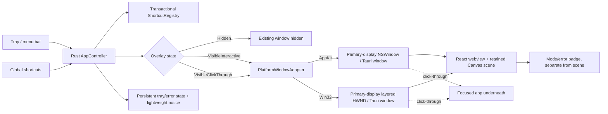

# Phase 1: Native Overlay & Activation - Research

**Researched:** 2026-09-09
**Domain:** Tauri 2 desktop overlay, macOS AppKit and Windows Win32 window/input integration
**Confidence:** MEDIUM

<user_constraints>
## User Constraints (from CONTEXT.md)

### Locked Decisions

#### Khởi động và kích hoạt
- **D-01:** nABrush starts in the background with the overlay hidden.
- **D-02:** The default overlay toggle shortcut is `⌘/Ctrl + Shift + A`.
- **D-03:** The shortcut registry is configurable; the default must be replaceable by the user.
- **D-04:** Closing the settings window or toolbar hides that UI while the app continues running from the menu bar/system tray. Only an explicit Quit action exits the process.
- **D-05:** Launch at login is off by default and can be enabled in settings.

#### Chuyển chế độ an toàn
- **D-06:** Use separate shortcuts for overlay visibility, click-through, and emergency hide instead of cycling several states through one key.
- **D-07:** All user-facing shortcuts, including click-through and an alternate emergency shortcut, are configurable.
- **D-08:** Show a small corner badge and cursor feedback when the mode changes; the badge may auto-hide and must stay out of exported output.
- **D-09:** Click-through is a global state applied atomically to every overlay surface, with global shortcuts still active.
- **D-10:** `Esc` is always available as an emergency hide shortcut. It immediately hides every overlay, preserves the current in-memory scene, and may have a second configurable emergency shortcut.

#### Phạm vi overlay Phase 1
- **D-11:** The Phase 1 harness targets the primary display only; Phase 2 owns all connected-display topology and per-monitor reconciliation.
- **D-12:** The harness uses one transparent, borderless, topmost native window covering the full primary display.
- **D-13:** Toggling the overlay from hidden enters drawing mode immediately.
- **D-14:** With no annotations, the overlay is fully transparent and does not dim or tint the underlying content.

#### Lỗi và khôi phục
- **D-15:** Missing permissions, shortcut conflicts, and overlay initialization failures are reported through a lightweight notification plus persistent state in the menu bar/system tray; avoid blocking modal dialogs during presentation.
- **D-16:** If a shortcut conflicts, reject the new registration, preserve the last working shortcut, and suggest choosing another key.
- **D-17:** If an overlay cannot initialize, keep the app running in the background with overlays hidden, retain the current scene, and offer an explicit retry.
- **D-18:** Error badges provide contextual `Retry` and, where relevant, `Open System Settings` actions.

### the agent's Discretion
- Exact secondary shortcut defaults, provided they are documented, conflict-checked, and configurable.
- Exact badge placement, animation, auto-hide duration, and cursor treatment, provided the feedback is visible without obscuring presentation content.
- Native window flags, IPC command names, tray icon artwork, and platform-specific error wording within the behavior above.
- Harness test fixtures and the minimum OS versions used for Phase 1 validation, subject to the documented support matrix and real-device checks.

### Deferred Ideas (OUT OF SCOPE)
- Multi-monitor overlay reconciliation and mixed-DPI/orientation support — Phase 2.
- Cursor halo, spotlight, magnifier, stylus pressure, snapshots, and presentation presets — v2 or later.
- Billing, accounts, cloud sync, collaboration, recording, AI/OCR, and document-style whiteboard — outside v1.

[VERIFIED: .planning/phases/01-native-overlay-activation/01-CONTEXT.md:16-46,92-97 — quoted verbatim from the phase decisions and deferred ideas.]
</user_constraints>

<phase_requirements>
## Phase Requirements

| ID | Description | Research Support |
|----|-------------|------------------|
| OVLY-01 | User can launch nABrush and keep it available from a macOS menu bar or Windows system tray entry. | Use a Tauri tray icon/menu as the process lifecycle surface; intercept settings/toolbar close and reserve Quit for `app.exit`. |
| OVLY-02 | User can toggle the drawing overlay on or off with a configurable global keyboard shortcut while another app is focused. | Register shortcuts in Rust through `tauri-plugin-global-shortcut`; keep a transactional registry and report collisions without replacing the last working binding. |
| OVLY-03 | User can switch between drawing mode, which captures pointer input, and click-through mode, which passes pointer input to the app underneath. | Model `VisibleInteractive` and `VisibleClickThrough`; use Tauri's cursor-event and focus APIs first, with AppKit/Win32 adapters for native edge cases. |
| OVLY-04 | User can trigger an emergency hide action that removes every overlay without clearing the annotation scene. | Make `Hidden` an idempotent native transition that calls `hide` on the existing window and leaves the retained in-memory scene untouched. |
| OVLY-05 | User can see the current overlay mode and capture/permission errors through an indicator that is not included in exported images. | Render mode/error feedback as a webview badge layer separate from the annotation scene; keep it out of the phase's scene/export contract. |

Requirements OVLY-01 through OVLY-05 are the exact overlay requirements in `.planning/REQUIREMENTS.md:10-16` [VERIFIED: .planning/REQUIREMENTS.md:10-16].
</phase_requirements>

## Summary

The smallest reliable Phase 1 is a Tauri 2 app with a hidden, transparent, borderless overlay window, a Rust-owned lifecycle controller, and a tray menu. Tauri's window API directly covers visibility, focusability, cursor-event ignoring, z-order, monitor lookup, and geometry; use those APIs for the common path. Its transparent macOS webview path requires the `macOSPrivateApi` configuration and therefore needs direct signed/notarized distribution planning rather than an App Store assumption. [CITED: https://v2.tauri.app/reference/config/] [CITED: https://v2.tauri.app/reference/javascript/api/namespacewindow/] [CITED: https://v2.tauri.app/distribute/sign/macos/]

Treat overlay mode as an explicit native state machine: `Hidden`, `VisibleInteractive`, and `VisibleClickThrough`. The mode transition must operate on the same existing window, be serialized, and be idempotent. In click-through mode, native pointer hit testing changes while global shortcut handling remains active; in emergency hide, the window is hidden and the scene store remains alive. This is the key contract that lets a user recover from a presentation mistake without losing marks. [VERIFIED: .planning/research/ARCHITECTURE.md:116-120 — “Model `Hidden`, `VisibleInteractive`, and `VisibleClickThrough` independently from the renderer. `VisibleInteractive` controls native hit testing and focus; `VisibleClickThrough` leaves the pixels on screen but passes pointer activity through. Hotkey handling remains active in both states.”]

The Tauri global-shortcut plugin and tray APIs are the standard integration points. Platform adapters are still needed behind a small interface to validate AppKit Space/full-screen behavior and, on Windows, to inspect or adjust layered-window styles and hit testing. Mock-runtime tests can cover state and command logic, but z-order, global shortcuts, click-through, full-screen surfaces, and permission prompts require embedded WebDriver smoke tests plus physical macOS and Windows checks. [CITED: https://v2.tauri.app/plugin/global-shortcut/] [CITED: https://v2.tauri.app/learn/system-tray/] [CITED: https://v2.tauri.app/develop/tests/] [CITED: https://v2.tauri.app/develop/tests/webdriver/]

**Primary recommendation:** Build one primary-display Tauri overlay window, keep the controller and shortcut registry in Rust, keep the retained scene in the long-lived webview, and expose only typed commands/events through an explicit capability file; hide/show and click-through should use the same native window throughout its lifetime.

## Architectural Responsibility Map

| Capability | Primary Tier | Secondary Tier | Rationale |
|------------|-------------|----------------|-----------|
| Tray/menu-bar process lifecycle | Browser / Client | Frontend Server (native shell) | The tray is the user-facing desktop entry point, while Rust owns the process and explicit Quit action. [ASSUMED] |
| Overlay visibility and mode state | API / Backend (Rust) | Browser / Client | Rust must serialize global shortcut and tray events even while the webview is hidden; React reflects the state. [ASSUMED] |
| Native window geometry and z-order | API / Backend (Rust) | Browser / Client | AppKit/Win32 window flags are OS responsibilities; the webview should not attempt to emulate them. [CITED: https://v2.tauri.app/reference/javascript/api/namespacewindow/] |
| Pointer capture versus click-through | API / Backend (Rust) | Browser / Client | Native hit testing decides whether the underlying application receives input; the canvas consumes pointer events only in interactive mode. [CITED: https://developer.apple.com/documentation/appkit/nswindow/ignoresmouseevents] [CITED: https://learn.microsoft.com/en-us/windows/win32/winmsg/window-features] |
| Global shortcut registration | API / Backend (Rust) | Browser / Client | Registration and conflict handling must remain active when the overlay is hidden. [CITED: https://v2.tauri.app/plugin/global-shortcut/] |
| Retained in-memory annotation scene | Browser / Client | — | The renderer already owns semantic drawing state in the webview; native hide/show must not destroy that state. [ASSUMED] |
| Mode/error badge | Browser / Client | — | The badge is UI state and must be composited separately from the annotation scene so it cannot enter export. [ASSUMED] |

## Project Constraints (from AGENTS.md)

- Platforms: macOS and Windows are the first-release scope. [VERIFIED: AGENTS.md:11 — “Platforms: macOS và Windows — đây là phạm vi phát hành ngay từ bản đầu.”]
- Interaction: the drawing layer must switch between capturing mouse input and click-through to the application below. [VERIFIED: AGENTS.md:12 — “Interaction: Lớp vẽ phải chuyển được giữa chế độ bắt chuột để vẽ và chế độ click-through để thao tác ứng dụng bên dưới.”]
- Performance: strokes must render smoothly during presentations and full-screen application use. [VERIFIED: AGENTS.md:13 — “Performance: Nét vẽ phải hiển thị mượt trong khi trình chiếu hoặc dùng ứng dụng toàn màn hình.”]
- Distribution: ship a free basic path while leaving room for later paid functionality. [VERIFIED: AGENTS.md:14 — “Distribution: Có đường phát hành miễn phí cơ bản và chừa không gian cho tính năng trả phí sau khi có dữ liệu sử dụng.”]
- Privacy: annotation and image export process locally by default and do not require uploading screen content. [VERIFIED: AGENTS.md:15 — “Privacy: Chức năng chú thích và xuất ảnh nên xử lý cục bộ theo mặc định, không yêu cầu tải nội dung màn hình lên máy chủ.”]

## Standard Stack

### Core

| Library | Version | Purpose | Why Standard |
|---------|---------|---------|--------------|
| Tauri Rust crates (`tauri`, `tauri-build`) | 2.x; project baseline is 2.11.x | Native desktop shell, window creation, IPC, bundling | Tauri's official API exposes the transparent/topmost/focus/cursor-event window controls needed by this phase and keeps platform code in Rust. [CITED: https://v2.tauri.app/reference/config/] |
| `@tauri-apps/api` | 2.11.1 | Typed frontend window/event/monitor calls | The npm registry returned version `2.11.1` on 2026-09-09; package-legitimacy verdict was OK and the package source is the Tauri repository. [VERIFIED: npm registry] |
| `@tauri-apps/cli` | 2.11.4 | Dev server orchestration, build and bundle commands | The npm registry returned version `2.11.4` on 2026-09-09; package-legitimacy verdict was OK and the package source is the Tauri repository. [VERIFIED: npm registry] |
| Rust stable toolchain | Pin in `rust-toolchain.toml` | Native adapters, lifecycle controller, tests | The global-shortcut plugin documents Rust 1.77.2 or newer as its minimum. Pin the project's tested stable toolchain once the build host is available. [CITED: https://v2.tauri.app/plugin/global-shortcut/] |
| React + TypeScript | React 19.2.8; TypeScript 7.0.2 | Toolbar/settings/badge UI and retained scene store | React and TypeScript are already the locked project UI direction; both packages passed the package-legitimacy check. [VERIFIED: npm registry] [VERIFIED: .planning/research/STACK.md:31-33 — “React + TypeScript | React 19.x / TypeScript 5.x, exact versions pinned by lockfile”] |
| Vite | 8.2.2 | Frontend dev server and production build | Tauri's current official frontend guide documents Vite configuration with `frontendDist`, `devUrl`, and the project dev/build commands. The registry returned 8.2.2, but the legitimacy gate flagged this very recent package as SUS; require a human verification checkpoint before installation. [CITED: https://v2.tauri.app/start/frontend/vite/] [WARNING: flagged as suspicious — verify before using.]

### Supporting

| Library | Version | Purpose | When to Use |
|---------|---------|---------|-------------|
| `tauri-plugin-global-shortcut` | 2.3.2 | System-wide visibility, click-through, and emergency shortcuts | Use as the primary registration path. The plugin supports macOS and Windows, exposes Pressed/Released events, and reports registration failure when another app owns a shortcut. [CITED: https://v2.tauri.app/plugin/global-shortcut/] [VERIFIED: npm registry] |
| `@vitejs/plugin-react` | 6.1.1 | React transform for Vite | Needed by a React/Vite scaffold; the registry package was flagged SUS because it is very recent, so add a human verification checkpoint before installation. [CITED: https://vite.dev/guide/] [WARNING: flagged as suspicious — verify before using.] |
| `@types/react` | 19.2.18 | React TypeScript declarations | Use for the typed UI; package-legitimacy verdict was OK. [VERIFIED: npm registry] |
| `@types/react-dom` | 19.2.7 | React DOM TypeScript declarations | Use for the typed UI only after a human verification checkpoint; package-legitimacy flagged this very recent release SUS. [WARNING: flagged as suspicious — verify before using.] |
| Vitest | 5.0.0 | Fast unit tests for pure TS state and transition helpers | Use for scene/mode reducer and shortcut validation tests. The registry package was flagged SUS for recency; planner must gate installation with `checkpoint:human-verify`. [CITED: https://vitest.dev/guide/] [WARNING: flagged as suspicious — verify before using.] |
| `@wdio/tauri-service` with WebdriverIO | `@wdio/tauri-service` 1.4.0; WDIO 9.31.x packages | Embedded WebDriver smoke tests against a built Tauri app | Use for lifecycle and webview IPC smoke tests where the platform runner supports it. The registry packages were flagged SUS for recency; planner must gate each install with `checkpoint:human-verify`. [CITED: https://v2.tauri.app/develop/tests/webdriver/] [WARNING: flagged as suspicious — verify before using.] |
| Canvas 2D (`CanvasRenderingContext2D`) | WebView platform API | Overlay pixels and temporary mode feedback | Use a transparent canvas with a retained scene; avoid a permanent animation loop when empty or static. [CITED: https://developer.mozilla.org/en-US/docs/Web/API/CanvasRenderingContext2D] [CITED: https://developer.mozilla.org/en-US/docs/Web/API/Canvas_API/Tutorial/Optimizing_canvas] |

### Alternatives Considered

| Instead of | Could Use | Tradeoff |
|------------|-----------|----------|
| Tauri window API plus a narrow native adapter | Electron `BrowserWindow` | Electron can implement transparent/topmost/click-through windows, but adds a bundled Chromium/Node process and a larger patch surface. Keep it as a fallback only if a native acceptance test proves Tauri cannot meet the overlay contract. [CITED: https://www.electronjs.org/docs/latest/api/browser-window] |
| Tauri global-shortcut plugin | Raw macOS `CGEventTap` or Windows `RegisterHotKey` directly | Raw APIs increase native code and permission/diagnostic burden. Use them only inside a platform adapter after the plugin path is tested and a concrete limitation is recorded. [CITED: https://developer.apple.com/documentation/coregraphics/cgevent/tapcreate(tap:place:options:eventsofinterest:callback:userinfo:)] [CITED: https://learn.microsoft.com/en-us/windows/win32/api/winuser/nf-winuser-registerhotkey] |
| Canvas 2D | SVG object tree or WebGL | SVG creates high-frequency DOM work; WebGL adds shader/text/readback complexity. The retained Canvas path is sufficient for this phase's one transparent surface. [CITED: https://developer.mozilla.org/en-US/docs/Web/API/Canvas_API/Tutorial/Optimizing_canvas] |

**Installation:**

```bash
pnpm init
pnpm add @tauri-apps/api@2.11.1 react@19.2.8 react-dom@19.2.8
pnpm add -D @tauri-apps/cli@2.11.4 typescript@7.0.2 vite@8.2.2 @vitejs/plugin-react@6.1.1 @types/react@19.2.18 @types/react-dom@19.2.7
pnpm add @tauri-apps/plugin-global-shortcut@2.3.2
```

The command is a manual scaffold so package installation and configuration are visible. `create-tauri-app`, `create-vite`, Vite, `@vitejs/plugin-react`, and `@types/react-dom` were not all clean under the legitimacy gate at this date; `create-tauri-app` and `create-vite` are omitted from the recommended install and the remaining SUS packages require a human checkpoint. [CITED: https://v2.tauri.app/start/create-project/] [ASSUMED]

**Version verification:** The registry checks above were run on 2026-09-09. Re-run `npm view <package> version` and the package-legitimacy gate when the phase is executed, then pin the resulting versions in the lockfile. Cargo was unavailable in this research environment, so pin `tauri`, `tauri-build`, and `tauri-plugin-global-shortcut` from `Cargo.lock` after installing Rust. [VERIFIED: environment probe 2026-09-09] [ASSUMED]

## Package Legitimacy Audit

| Package | Registry | Age | Downloads | Source Repo | Verdict | Disposition |
|---------|----------|-----|-----------|-------------|---------|-------------|
| `@tauri-apps/api` | npm | ~3 mo | 2.18M/wk | github.com/tauri-apps/tauri | OK | Approved |
| `@tauri-apps/cli` | npm | ~2 mo | 2.02M/wk | github.com/tauri-apps/tauri | OK | Approved |
| `@tauri-apps/plugin-global-shortcut` | npm | ~3 mo | 77.8K/wk | github.com/tauri-apps/plugins-workspace | OK | Approved |
| `react` | npm | ~2 mo | 152.8M/wk | github.com/facebook/react | OK | Approved |
| `react-dom` | npm | ~2 mo | 143.6M/wk | github.com/facebook/react | OK | Approved |
| `typescript` | npm | ~2 mo | 244.7M/wk | github.com/microsoft/TypeScript | OK | Approved |
| `@types/react` | npm | ~1 mo | 141.8M/wk | github.com/DefinitelyTyped/DefinitelyTyped | OK | Approved |
| `vite` | npm | ~20 days | 158.6M/wk | github.com/vitejs/vite | SUS | Flagged — planner must add `checkpoint:human-verify` before install |
| `@vitejs/plugin-react` | npm | ~12 days | 74.7M/wk | github.com/vitejs/vite-plugin-react | SUS | Flagged — planner must add `checkpoint:human-verify` before install |
| `@types/react-dom` | npm | ~6 days | 118.5M/wk | github.com/DefinitelyTyped/DefinitelyTyped | SUS | Flagged — planner must add `checkpoint:human-verify` before install |
| `vitest` | npm | ~6 days | 92.7M/wk | github.com/vitest-dev/vitest | SUS | Flagged — planner must add `checkpoint:human-verify` before install |
| `@wdio/cli`, `@wdio/local-runner`, `@wdio/mocha-framework`, `@wdio/spec-reporter` | npm | ~2–19 days | 0.7–0.9M/wk | github.com/webdriverio/webdriverio | SUS | Flagged — planner must add a checkpoint before each install |
| `@wdio/tauri-service` | npm | ~3 days | 37.9K/wk | github.com/webdriverio/desktop-mobile | SUS | Flagged — planner must add `checkpoint:human-verify` before install |

`create-tauri-app` and `create-vite` were checked but omitted from the recommended stack because the legitimacy gate flagged them SUS for recency. No package listed in the audit had a network or out-of-project filesystem `postinstall` script in the registry probe. [VERIFIED: package-legitimacy gate and npm registry probes, 2026-09-09]

**Packages removed due to [SLOP] verdict:** none.
**Packages flagged as suspicious [SUS]:** `vite`, `@vitejs/plugin-react`, `@types/react-dom`, `vitest`, `@wdio/cli`, `@wdio/local-runner`, `@wdio/mocha-framework`, `@wdio/spec-reporter`, `@wdio/tauri-service`; planner inserts `checkpoint:human-verify` before each install.

## Architecture Patterns

### System Architecture Diagram



The diagram is a conceptual flow: tray and global shortcuts enter the Rust controller; one state transition updates the existing native overlay; the React canvas renders the retained scene; click-through returns pointer activity to the focused app while the controller still receives shortcuts. [ASSUMED]

### Recommended Project Structure

```text
src/
├── overlay/
│   ├── model.ts          # OverlayMode and typed UI events
│   ├── sceneStore.ts     # In-memory semantic scene, kept alive while hidden
│   └── OverlayCanvas.tsx # Canvas and badge layers
├── shortcuts/
│   └── bindings.ts       # User binding schema and display labels
└── App.tsx               # Tray/settings surface and mode controls
src-tauri/
├── src/
│   ├── controller.rs      # Serialized lifecycle/state transitions
│   ├── shortcuts.rs       # Plugin registration and conflict rollback
│   ├── tray.rs            # Tray menu and Quit lifecycle
│   ├── overlay/
│   │   ├── mod.rs         # OverlayWindowAdapter contract
│   │   ├── macos.rs       # AppKit Space/focus/transparency adapter
│   │   └── windows.rs     # Win32 style/hit-test adapter
│   └── lib.rs             # Tauri builder and command registration
├── capabilities/
│   └── default.json       # Least-privilege window/plugin permissions
└── tauri.conf.json        # One hidden primary overlay window
```

The folder names are implementation guidance, not existing files; the repository is greenfield. [VERIFIED: .planning/phases/01-native-overlay-activation/01-CONTEXT.md:81-88 — “None yet. The repository is a greenfield project containing planning artifacts only.”]

### Pattern 1: Explicit, idempotent native mode transitions

**What:** Keep one enum and one controller transition path for `Hidden`, `VisibleInteractive`, and `VisibleClickThrough`. Apply the same ordered operations to the existing window: for hide, remove input/focus and hide; for interactive, enable cursor events/focus and show; for click-through, disable cursor events and focus while keeping pixels visible. Serialize transitions so a shortcut cannot interleave with a tray action. [VERIFIED: .planning/research/ARCHITECTURE.md:116-120]

**When to use:** Every shortcut, tray action, initialization retry, and future display reconciliation. [ASSUMED]

**Example:**

```typescript
import { getCurrentWindow } from "@tauri-apps/api/window";

type OverlayMode = "Hidden" | "VisibleInteractive" | "VisibleClickThrough";

export async function applyOverlayMode(mode: OverlayMode): Promise<void> {
  const overlay = getCurrentWindow();
  if (mode === "Hidden") {
    await overlay.setIgnoreCursorEvents(true);
    await overlay.setFocusable(false);
    await overlay.hide();
    return;
  }

  await overlay.setIgnoreCursorEvents(mode === "VisibleClickThrough");
  await overlay.setFocusable(mode === "VisibleInteractive");
  await overlay.show();
}
```

Tauri documents `setIgnoreCursorEvents(true)` as ignoring cursor events, `setFocusable(false)` as removing focusability, and `show`/`hide` as visibility controls. The real controller should test the focus order on macOS because Tauri documents that an already focused window cannot be unfocused merely by calling `setFocusable(false)`; move focus back to the underlying app before finalizing click-through. [CITED: https://v2.tauri.app/reference/javascript/api/namespacewindow/]

### Pattern 2: Transactional shortcut registry

**What:** Maintain `workingBindings` separately from a proposed binding set. Register a proposed shortcut first; commit the new set only after every required binding succeeds. If one registration fails, unregister only registrations made by that attempt, keep the previous set active, and put a non-blocking conflict/error state in the tray. [CITED: https://v2.tauri.app/plugin/global-shortcut/] [ASSUMED]

**When to use:** Initial startup, settings rebinding, retry after a conflict, and app shutdown. [ASSUMED]

**Example:**

```typescript
import { register } from "@tauri-apps/plugin-global-shortcut";

// The documented plugin grammar uses a string such as this example;
// the product's persisted binding is substituted after conflict checking.
await register("CommandOrControl+Shift+C", ({ state }) => {
  if (state === "Pressed") {
    // Send a typed command to the Rust controller.
  }
});
```

The plugin documents `register`, `unregister`, `isRegistered`, Pressed/Released event state, and no callback when another application owns the shortcut. The `CommandOrControl+Shift+C` string above is the official usage shape; use the configured product binding at runtime, including the locked default `⌘/Ctrl + Shift + A`. [CITED: https://v2.tauri.app/plugin/global-shortcut/] [VERIFIED: .planning/phases/01-native-overlay-activation/01-CONTEXT.md:18 — “The default overlay toggle shortcut is `⌘/Ctrl + Shift + A`.”]

### Pattern 3: Tray owns the application lifetime

**What:** Create one tray icon/menu during app setup. Menu actions dispatch show/hide, click-through, retry, and settings commands; only the explicit Quit item calls `app.exit(0)`. A settings/toolbar close request hides that window and prevents the default close path. [CITED: https://v2.tauri.app/learn/system-tray/] [CITED: https://v2.tauri.app/reference/javascript/api/namespacewindow/]

**When to use:** Background startup and every UI close path. [VERIFIED: .planning/phases/01-native-overlay-activation/01-CONTEXT.md:20 — “Only an explicit Quit action exits the process.”]

**Example:**

```rust
use tauri::tray::TrayIconBuilder;

TrayIconBuilder::new()
    .menu(&menu)
    .show_menu_on_left_click(true)
    .on_menu_event(|app, event| {
        if event.id().as_ref() == "quit" {
            app.exit(0);
        }
    })
    .build(app)?;
```

The tray documentation provides `TrayIconBuilder`, menu event handling, left-click menu configuration, and explicit `app.exit(0)` behavior. The `quit` identifier is a local menu-item identifier and may be renamed. [CITED: https://v2.tauri.app/learn/system-tray/]

### Pattern 4: Thin platform adapter behind a stable controller contract

**What:** Keep Rust controller logic platform-neutral and implement only the native differences behind `OverlayWindowAdapter`. Tauri's window API is the first implementation; AppKit and Win32 code is limited to flags or lifecycle behavior that the Tauri path cannot guarantee. [ASSUMED]

**macOS adapter:** Configure a transparent borderless window, use an appropriate floating level, and validate `NSWindow.ignoresMouseEvents` for click-through. For full-screen Spaces and Stage Manager, test `fullScreenAuxiliary` and/or `canJoinAllApplications`; these AppKit collection behaviors have mutual-exclusion and layout rules. `canJoinAllSpaces` is a separate option when the product explicitly wants every Space. [CITED: https://developer.apple.com/documentation/appkit/nswindow/ignoresmouseevents] [CITED: https://developer.apple.com/documentation/appkit/nswindow/collectionbehavior-swift.struct]

**Windows adapter:** Use a top-level layered popup with `WS_EX_LAYERED`, `WS_EX_TOOLWINDOW`, and `WS_EX_NOACTIVATE`, place it with `HWND_TOPMOST`/`SetWindowPos`, and change pass-through behavior on the existing HWND. Microsoft documents alpha composition and transparent hit testing for layered windows; `WS_EX_TRANSPARENT` passes mouse events underneath. [CITED: https://learn.microsoft.com/en-us/windows/win32/winmsg/window-features]

### Pattern 5: Configuration for a hidden, transparent overlay

**What:** Start the overlay window hidden and transparent; disable decorations; keep it topmost; make it non-focusable until interactive mode; use platform-specific config overrides for Windows-only flags. Tauri documents `macOSPrivateApi` as enabling its transparent-background API, and warns that private APIs prevent App Store acceptance. [CITED: https://v2.tauri.app/reference/config/]

**Example:**

```json
{
  "app": {
    "macOSPrivateApi": true,
    "windows": [
      {
        "transparent": true,
        "decorations": false,
        "alwaysOnTop": true,
        "focus": false,
        "focusable": false,
        "visible": false,
        "skipTaskbar": true,
        "noRedirectionBitmap": true
      }
    ]
  }
}
```

Use `skipTaskbar` and `noRedirectionBitmap` only where their platform behavior is useful: Tauri documents `skipTaskbar` as unsupported on macOS and `noRedirectionBitmap` as a Windows option to avoid a white flash. Confirm the exact generated window behavior in the first native tracer. [CITED: https://v2.tauri.app/reference/config/] [ASSUMED]

### Anti-Patterns to Avoid

- **Recreating a window for every mode switch:** z-order, focus, and pointer capture can glitch; change styles and visibility on one existing native window. [ASSUMED]
- **Cycling visibility, click-through, and emergency hide through one shortcut:** separate configured bindings are locked by D-06/D-07. [VERIFIED: .planning/phases/01-native-overlay-activation/01-CONTEXT.md:24-28]
- **Letting the React canvas decide native hit testing:** native AppKit/Win32 state must own whether the underlying app receives input. [CITED: https://developer.apple.com/documentation/appkit/nswindow/ignoresmouseevents] [CITED: https://learn.microsoft.com/en-us/windows/win32/winmsg/window-features]
- **Destroying the webview on hide:** hide the native window and keep the scene store alive so Esc recovery preserves marks. [VERIFIED: .planning/phases/01-native-overlay-activation/01-CONTEXT.md:28]
- **Using a raw event tap as an invisible shortcut fallback:** macOS key event taps require Accessibility/assistive-device permission; surface the missing permission and keep the last working binding instead. [CITED: https://developer.apple.com/documentation/coregraphics/cgevent/tapcreate(tap:place:options:eventsofinterest:callback:userinfo:)]

## Don't Hand-Roll

| Problem | Don't Build | Use Instead | Why |
|---------|-------------|-------------|-----|
| System-wide shortcut registration | A custom keyboard hook in the webview | `tauri-plugin-global-shortcut` | The official plugin already exposes registration, unregister, status checks, press/release events, and platform support. [CITED: https://v2.tauri.app/plugin/global-shortcut/] |
| Tray/menu-bar lifecycle | A second hidden window pretending to be a tray | Tauri `TrayIconBuilder` and menu events | It provides native tray lifecycle and explicit Quit handling. [CITED: https://v2.tauri.app/learn/system-tray/] |
| Transparent window visibility and cursor events | A custom full-screen compositor | Tauri Window API (`show`, `hide`, `setIgnoreCursorEvents`, `setFocusable`) | These operations are already typed and cross-platform; use native code only for proven gaps. [CITED: https://v2.tauri.app/reference/javascript/api/namespacewindow/] |
| macOS event tap permission | Silent raw `CGEventTap` fallback | Tauri shortcut plugin; explicit Accessibility guidance if a later adapter truly needs event taps | Event taps can fail without Accessibility permission and are a privacy-sensitive escalation. [CITED: https://developer.apple.com/documentation/coregraphics/cgevent/tapcreate(tap:place:options:eventsofinterest:callback:userinfo:)] |
| Windows alpha and hit testing | A bitmap copy of the desktop or polling the pointer | Layered HWND styles and native hit-test behavior | Windows documents per-pixel alpha and transparent hit testing for layered windows. [CITED: https://learn.microsoft.com/en-us/windows/win32/winmsg/window-features] |
| Capability permission plumbing | An unrestricted all-commands capability | Tauri capability/permission files with only required window and shortcut commands | Capabilities define which commands a window/webview may use; permissions are explicit privileges. [CITED: https://v2.tauri.app/security/capabilities/] [CITED: https://v2.tauri.app/security/permissions/]

**Key insight:** The difficult part is the transition boundary between a browser webview and the operating system's window manager. Reusing Tauri's tested primitives and isolating the few AppKit/Win32 exceptions prevents shortcut, focus, z-order, and permission behavior from leaking into the drawing renderer. [ASSUMED]

## Common Pitfalls

### Pitfall 1: macOS transparency and distribution mismatch

**What goes wrong:** A transparent Tauri webview works in a local build but cannot be submitted to the Mac App Store because the documented path uses private APIs. [CITED: https://v2.tauri.app/reference/config/]

**Why it happens:** `macOSPrivateApi` is easy to treat as an implementation detail even though it changes the distribution contract. [ASSUMED]

**How to avoid:** Keep the native adapter behind an interface, choose direct signed/notarized distribution for the initial spike, and record App Store compatibility as an explicit product decision. [CITED: https://v2.tauri.app/distribute/sign/macos/] [ASSUMED]

**Warning signs:** A release target includes App Store packaging while `macOSPrivateApi` remains true. [ASSUMED]

### Pitfall 2: topmost is not the same as above every full-screen surface

**What goes wrong:** The overlay appears above normal windows but is hidden behind a native or exclusive full-screen surface. [CITED: https://developer.apple.com/documentation/appkit/nswindow/collectionbehavior-swift.struct] [CITED: https://learn.microsoft.com/en-us/windows/win32/winmsg/window-features]

**Why it happens:** AppKit Space/Stage Manager collection behavior and Windows desktop composition have separate policies from ordinary z-order. [CITED: https://developer.apple.com/documentation/appkit/nswindow/collectionbehavior-swift.struct] [ASSUMED]

**How to avoid:** Validate native full-screen, borderless full-screen, Spaces, and Stage Manager on a real Mac; classify Windows exclusive graphics modes separately in the support matrix and retain Esc emergency hide. [ASSUMED]

**Warning signs:** A passing normal-window test is treated as proof that all presentation surfaces work. [ASSUMED]

### Pitfall 3: focus order breaks click-through

**What goes wrong:** Click-through pixels remain visible but the underlying app does not receive focus or mouse input. [CITED: https://v2.tauri.app/reference/javascript/api/namespacewindow/]

**Why it happens:** Tauri documents a macOS caveat where an already focused window cannot be unfocused after `setFocusable(false)` alone. [CITED: https://v2.tauri.app/reference/javascript/api/namespacewindow/]

**How to avoid:** Transition pointer-ignore, focusability, visibility, and focus restoration in a single serialized native operation; test clicking and scrolling in the target app after each transition. [ASSUMED]

**Warning signs:** `setIgnoreCursorEvents(true)` passes hover but clicks still activate the overlay or the overlay remains the active application. [ASSUMED]

### Pitfall 4: Windows transparent overlays flash or steal activation

**What goes wrong:** A first show flashes white, activates the overlay, or places it below another window. [CITED: https://v2.tauri.app/reference/config/] [CITED: https://learn.microsoft.com/en-us/windows/win32/winmsg/window-features]

**Why it happens:** Layered windows require an alpha-composited surface and z-order/activation flags; the redirection bitmap can produce a white flash. [CITED: https://v2.tauri.app/reference/config/] [ASSUMED]

**How to avoid:** Use `noRedirectionBitmap` where supported, `WS_EX_NOACTIVATE`, a layered surface, and `SetWindowPos` with no-activate semantics in the native adapter; verify the existing HWND is modified instead of recreated. [CITED: https://learn.microsoft.com/en-us/windows/win32/winmsg/window-features] [ASSUMED]

**Warning signs:** The tracer passes an alpha screenshot test but fails the first-frame or focus test. [ASSUMED]

### Pitfall 5: one failed shortcut registration destroys all bindings

**What goes wrong:** A user rebinding one shortcut loses the working toggle or emergency action because registration was updated in place. [CITED: https://v2.tauri.app/plugin/global-shortcut/]

**Why it happens:** Global registration can fail when another application already owns a shortcut, and the plugin does not make a failed binding usable. [CITED: https://v2.tauri.app/plugin/global-shortcut/]

**How to avoid:** Register the proposed set transactionally, roll back only the attempt, preserve the last working set, and show a persistent tray error with a suggested alternative. [VERIFIED: .planning/phases/01-native-overlay-activation/01-CONTEXT.md:37-40] [ASSUMED]

**Warning signs:** Settings show a new binding while the old one is no longer active and no error is visible. [ASSUMED]

### Pitfall 6: Esc is assumed to be globally available without a device test

**What goes wrong:** Emergency hide works when nABrush is focused but not when the presenter is in another app or full-screen surface. [ASSUMED]

**Why it happens:** Shortcut ownership, OS-reserved keys, and plugin behavior are platform-dependent; a raw macOS key event tap also has Accessibility requirements. [CITED: https://v2.tauri.app/plugin/global-shortcut/] [CITED: https://developer.apple.com/documentation/coregraphics/cgevent/tapcreate(tap:place:options:eventsofinterest:callback:userinfo:)]

**How to avoid:** Test bare `Escape` and a configurable alternate emergency binding from another application on both OSes. If bare Esc cannot be registered, report it as a product/support decision rather than silently changing the safety path. [ASSUMED]

**Warning signs:** Only a webview keydown listener is tested for emergency hide. [ASSUMED]

### Pitfall 7: capabilities are wider than the feature needs

**What goes wrong:** A compromised or malformed UI invocation can reach unrelated Tauri/plugin commands. [CITED: https://v2.tauri.app/security/capabilities/] [CITED: https://v2.tauri.app/security/permissions/]

**Why it happens:** Tauri custom commands are allowed to all windows by default unless the build manifest/capabilities restrict them. [CITED: https://v2.tauri.app/security/capabilities/]

**How to avoid:** Grant only the window commands and global-shortcut permissions needed by the overlay; keep filesystem/network/capture permissions out of this phase and configure a local CSP. [CITED: https://v2.tauri.app/security/capabilities/] [CITED: https://v2.tauri.app/security/csp/]

**Warning signs:** A default capability contains unrestricted `core:*`, filesystem scopes, or remote URLs. [ASSUMED]

### Pitfall 8: close destroys the background utility

**What goes wrong:** Clicking the settings or toolbar close button exits the process, so the tray and global bindings disappear. [VERIFIED: .planning/phases/01-native-overlay-activation/01-CONTEXT.md:20] [CITED: https://v2.tauri.app/reference/javascript/api/namespacewindow/]

**Why it happens:** Default window close behavior is allowed to proceed instead of intercepting `onCloseRequested`. [CITED: https://v2.tauri.app/reference/javascript/api/namespacewindow/]

**How to avoid:** Prevent close, hide the UI, and reserve process exit for the explicit tray Quit item. [ASSUMED]

**Warning signs:** Tray integration is tested only while the settings window is open. [ASSUMED]

## Code Examples

### Tauri native window configuration

```json
{
  "app": {
    "macOSPrivateApi": true,
    "windows": [
      {
        "transparent": true,
        "decorations": false,
        "alwaysOnTop": true,
        "focus": false,
        "focusable": false,
        "visible": false,
        "skipTaskbar": true,
        "noRedirectionBitmap": true
      }
    ]
  }
}
```

These are Tauri's documented configuration keys for transparency, decorations, z-order, focus, initial visibility, taskbar skipping, and the Windows redirection-bitmap option. Private API use is a direct-distribution constraint on macOS. [CITED: https://v2.tauri.app/reference/config/]

### Global shortcut handler

```typescript
import { register } from "@tauri-apps/plugin-global-shortcut";

await register("CommandOrControl+Shift+C", ({ state }) => {
  if (state === "Pressed") {
    // Dispatch a typed toggle command to the Rust controller.
  }
});
```

The string and Pressed state follow the plugin's documented registration shape; the product substitutes the user's configured binding. [CITED: https://v2.tauri.app/plugin/global-shortcut/]

### Tray Quit boundary

```rust
TrayIconBuilder::new()
    .menu(&menu)
    .on_menu_event(|app, event| {
        if event.id().as_ref() == "quit" {
            app.exit(0);
        }
    })
    .build(app)?;
```

The explicit Quit event is the only process exit path in the phase contract. [CITED: https://v2.tauri.app/learn/system-tray/] [VERIFIED: .planning/phases/01-native-overlay-activation/01-CONTEXT.md:20]

### Native adapter boundary

```rust
#[derive(Clone, Copy, Debug, PartialEq, Eq)]
pub enum OverlayMode {
    Hidden,
    VisibleInteractive,
    VisibleClickThrough,
}

pub trait OverlayWindowAdapter {
    fn apply_mode(&mut self, mode: OverlayMode) -> Result<(), OverlayError>;
    fn primary_display_bounds(&self) -> Result<DesktopRect, OverlayError>;
}
```

The enum values are the locked architecture state names; the trait and error types are proposed implementation names. [VERIFIED: .planning/research/ARCHITECTURE.md:116-120] [ASSUMED]

## Spike Acceptance Tests

The first vertical tracer should be judged by these observable tests before broad UI or drawing work proceeds. Tests marked **automated** can run in a built app; tests marked **device** require a physical OS environment because mock runtimes do not exercise native window managers. [CITED: https://v2.tauri.app/develop/tests/] [ASSUMED]

| ID | Test | Type | Pass condition |
|----|------|------|----------------|
| S1 | Cold start | automated + device | App process starts with no normal window visible; tray/menu-bar entry exists; overlay is hidden; no shortcut registration error is silently dropped. |
| S2 | Toggle from another app | device | Press configured toggle while another app is focused; one primary-display transparent window appears, no dim/tint is visible, and the first visible mode is interactive drawing. |
| S3 | Interactive pointer path | device | Pointer movement/click/drag in the overlay reaches the drawing surface and produces a test mark; the underlying app does not receive the same pointer action. |
| S4 | Atomic click-through | device | Invoke click-through shortcut; all overlay surfaces enter the same mode in one transition, the existing mark remains visible, the underlying app receives click/scroll, and global shortcuts still work. |
| S5 | Emergency hide recovery | device | Press bare Esc from the target app; overlay disappears immediately, the process/tray remains alive, and the same scene is visible after toggle restores interactive mode. |
| S6 | Shortcut conflict rollback | device/integration | Occupy a candidate binding with another app; rebinding is rejected, the last working binding remains active, and the tray/badge presents a retry/suggested-key action. |
| S7 | Close versus Quit | device | Close settings/toolbar hides that UI while the tray remains available; only the explicit tray Quit exits the process. |
| S8 | Initialization failure and retry | integration + device | Force adapter initialization failure; app stays background-only with scene retained and persistent Retry/Open System Settings state; retry can recover after the condition is fixed. |
| S9 | macOS Space/full-screen | device | Validate a normal app, native full-screen app, borderless full-screen app, another Space, and Stage Manager. Record whether the chosen `fullScreenAuxiliary`/`canJoinAllApplications` policy places the overlay correctly. |
| S10 | Windows z-order/hit testing | device | Validate normal and borderless full-screen apps; no activation/white flash occurs, layered alpha is correct, click-through reaches the app, and recovery works if exclusive full-screen hides the overlay. |
| S11 | Capability denial | automated | A command outside the capability file fails with a controlled error; allowed mode and shortcut commands still work. |
| S12 | Empty overlay pixels | device | With no annotations, the overlay contributes no dim/tint and the only visible transient UI is the configured badge/cursor feedback. |

## Real-device Validation Matrix

| Environment | Required checks | Expected evidence |
|-------------|-----------------|-------------------|
| macOS physical Mac, supported project minimum | tray lifecycle, toggle from another app, pointer capture, click-through, Esc, retry/error badge | screen recording or checklist showing window state, focus restoration, and scene preservation |
| macOS native full-screen + Spaces + Stage Manager | collection behavior and z-order under the chosen AppKit policy | per-surface pass/fail with documented limitation and recovery shortcut |
| macOS with Accessibility denied | global shortcut behavior and contextual Open System Settings path if a low-level fallback is attempted | no silent event-tap fallback; persistent permission state |
| Windows physical machine with WebView2 and project minimum | tray lifecycle, layered window, no activation, click-through, shortcut conflict, Esc | screenshots/logs plus click/scroll proof in an underlying app |
| Windows borderless full-screen | topmost composition, hit testing, restore | pass/fail and support-matrix entry |
| Windows exclusive full-screen or protected surface | recovery behavior | documented limitation if the compositor hides a normal topmost overlay |
| macOS and Windows CI | Rust/TypeScript unit tests and built-app WebDriver smoke tests | artifacts from both OS runners; no claim that CI alone proves native z-order |

Minimum OS versions and the final full-screen support classification remain discretionary and must be locked after this matrix is run. [VERIFIED: .planning/phases/01-native-overlay-activation/01-CONTEXT.md:42-46] [ASSUMED]

## State of the Art

| Old Approach | Current Approach | When Changed | Impact |
|--------------|------------------|--------------|--------|
| Treat transparent window behavior as a frontend CSS concern | Configure Tauri transparency and validate the native window manager, with a platform adapter for exceptions | Tauri 2 documentation currently exposes native window and transparency configuration | The canvas stays focused on pixels and semantic scene state. [CITED: https://v2.tauri.app/reference/config/] |
| Put global hotkeys in a webview keydown listener | Register through the Tauri global-shortcut plugin and handle events in the native app controller | Tauri 2 plugin documentation | Shortcuts remain available while the overlay is hidden and can report conflicts. [CITED: https://v2.tauri.app/plugin/global-shortcut/] |
| Use an external WebDriver daemon on every platform | Use Tauri's embedded WebDriver provider through `@wdio/tauri-service`, with platform-specific real-device checks | Current Tauri WebDriver documentation | macOS is testable through the embedded provider even when the direct `tauri-driver` path is unavailable. [CITED: https://v2.tauri.app/develop/tests/webdriver/] |
| Depend on legacy macOS screen capture in the activation path | Keep screen capture/export permission and APIs out of Phase 1; use ScreenCaptureKit only when export requires it | Current Apple ScreenCaptureKit guidance | Overlay activation does not prompt for Screen Recording permission. [CITED: https://developer.apple.com/documentation/screencapturekit] |

**Deprecated/outdated:**

- Raw macOS event taps as the default shortcut mechanism: use the dedicated Tauri plugin first; event taps have Accessibility requirements and should be an explicit, tested fallback only. [CITED: https://developer.apple.com/documentation/coregraphics/cgevent/tapcreate(tap:place:options:eventsofinterest:callback:userinfo:)]
- A single global desktop coordinate conversion for all monitors: multi-monitor topology is deferred to Phase 2, and future code must preserve per-monitor scale/origin. [VERIFIED: .planning/phases/01-native-overlay-activation/01-CONTEXT.md:31] [VERIFIED: .planning/research/ARCHITECTURE.md:122-126]

## Assumptions Log

| # | Claim | Section | Risk if Wrong |
|---|-------|---------|---------------|
| A1 | The Tauri window API is sufficient for the common show/hide/cursor-ignore path and only edge cases need native adapters. | Summary / Architecture | A native adapter may be required earlier, expanding Phase 1 Rust/OS work. |
| A2 | The retained annotation scene can stay in a long-lived React webview while its native window is hidden. | Responsibility Map | Emergency hide could require moving scene ownership into Rust or a separate process. |
| A3 | The documented plugin shortcut grammar can represent the product's `⌘/Ctrl + Shift + A` default on both target OSes. | Code Examples | Default registration or Esc safety behavior may need platform-specific normalization. |
| A4 | Bare Esc can be registered as a system-wide shortcut through the chosen plugin path on both target OSes. | Pitfalls / Spike Tests | D-10 may need a platform-specific native implementation and an explicit support decision. |
| A5 | Direct signed/notarized macOS distribution is acceptable while Tauri's private transparency API is enabled. | Pitfall 1 | App Store distribution would require a different shell/transparency strategy. |
| A6 | The project can standardize its minimum macOS/Windows versions after the real-device spike. | Validation Matrix | CI matrix and native API availability may need to be revised. |
| A7 | The package-legitimacy gate's SUS result is caused by package recency, not malicious behavior; each flagged package still needs human verification before installation. | Standard Stack / Audit | Planner may need to pin an older verified release or select a different test runner. |

## Resolved Open Questions

The following decisions close the questions raised during discovery. Device observations remain validation evidence for the chosen contract; they are no longer open design choices.

1. **Phase 1 minimum OS versions:** support macOS 13 Ventura or newer and Windows 10 22H2 or newer with Evergreen WebView2. [ASSUMED: CONTEXT.md grants the planner discretion over minimum versions; these baselines provide the AppKit Space policy, current Tauri 2 support, Win32 layered-window behavior, and maintained WebView2 runtime needed by this phase.] The CI matrix and `docs/support-matrix.md` use these exact lower bounds; older versions are outside the Phase 1 support contract.

2. **Initial macOS distribution:** use a signed and notarized direct-download DMG for the Phase 1 harness and the first public distribution path. [VERIFIED: Tauri's documented transparent macOS webview path uses `macOSPrivateApi`, which blocks Mac App Store acceptance: https://v2.tauri.app/reference/config/ and https://v2.tauri.app/distribute/sign/macos/] App Store packaging is excluded while that setting is enabled and is not a Phase 1 acceptance target.

3. **Bare `Escape` registration:** bare `Escape` is a required global emergency binding on both supported OS baselines and is registered through the global-shortcut/native registration path. [VERIFIED: D-10 requires an always-available Esc action.] If a target rejects the registration or reserves the key, the app reports the D-15 capability error, keeps the configured alternate emergency binding available, and records the platform result; it never silently substitutes a webview-only key listener or an unapproved event tap. The device check is evidence for this fixed contract, not an unresolved design question. [ASSUMED: exact reserved-key behavior requires the physical matrix.]

4. **Shortcut persistence:** bindings are session-scoped in Phase 1. A successful rebind is immediately active and remains active while the process runs, including after settings/toolbar close; a restart loads the documented defaults. [VERIFIED: D-03 and D-07 require configurable bindings but do not require restart persistence.] No store, migration, account, or database is part of this phase.

5. **Settings surface:** Phase 1 includes one small settings window opened from the tray/menu bar. It exposes visibility, click-through, alternate emergency shortcut rebinding, and launch-at-login opt-in; its close request hides the window while the tray process remains alive. [ASSUMED: this is the smallest concrete surface that makes D-03, D-05, and D-07 user reachable and satisfies D-04.] It does not add drawing-tool, capture, persistence, or billing settings.

## Environment Availability

| Dependency | Required By | Available | Version | Fallback |
|------------|-------------|-----------|---------|----------|
| Node.js | Vite/React/Tauri frontend tooling | ✓ | v25.8.2 | Install the project's pinned Node 24 LTS before CI/build standardization. [VERIFIED: environment probe 2026-09-09] [VERIFIED: .planning/research/STACK.md:39-40 — “Node.js | 24.x LTS”] |
| pnpm | frontend install/scripts | ✓ | 11.19.0 | Pin via Corepack/package manager metadata. [VERIFIED: environment probe 2026-09-09] |
| npm | registry/package verification | ✓ | 11.11.1 | — [VERIFIED: environment probe 2026-09-09] |
| Rust/cargo/rustup | Tauri native shell and `cargo test` | ✗ | — | Install stable Rust with the documented minimum before building; no native fallback for this phase. [CITED: https://v2.tauri.app/plugin/global-shortcut/] |
| Xcode command-line tools / macOS SDK | macOS Tauri build and AppKit adapter | ✗ | — | Build on a macOS CI runner or install the tools; no local fallback for native macOS validation. [ASSUMED] |
| Windows MSVC/Windows SDK/WebView2 | Windows Tauri build and Win32 adapter | ✗ on this macOS host | — | Use a Windows CI runner and a physical Windows device for native checks. [ASSUMED] |
| Physical macOS and Windows devices | z-order, global shortcuts, Spaces/full-screen | ✗ in this environment | — | Required device matrix in a later execution wave; mock tests cannot replace it. [CITED: https://v2.tauri.app/develop/tests/] |

**Missing dependencies with no fallback:** Rust toolchain and macOS build tools block local native build; Windows toolchain/device is required for Windows validation.

**Missing dependencies with fallback:** CI runners can supply the platform toolchains, but they do not replace the physical full-screen/permission matrix.

## Validation Architecture

### Test Framework

| Property | Value |
|----------|-------|
| Framework | Vitest 5.0.0 for TypeScript; Rust `cargo test` for native controller/adapters |
| Config file | None — Wave 0 must add Vitest and Cargo test configuration |
| Quick run command | `pnpm exec vitest run --passWithNoTests && cargo test --manifest-path src-tauri/Cargo.toml` |
| Full suite command | `pnpm exec vitest run && cargo test --manifest-path src-tauri/Cargo.toml` plus built-app WebDriver smoke tests on macOS and Windows |

Vitest and WebdriverIO packages are registry-valid but flagged SUS for recency in this session; the planner must add human verification checkpoints before installing them. [WARNING: flagged as suspicious — verify before using.]

### Phase Requirements → Test Map

| Req ID | Behavior | Test Type | Automated Command | File Exists? |
|--------|----------|-----------|-------------------|-------------|
| OVLY-01 | Tray/menu entry stays available; close hides UI; Quit exits | integration + device | `pnpm exec wdio run wdio.conf.ts --spec test/overlay/tray.e2e.ts` | ❌ Wave 0 |
| OVLY-02 | Configurable global shortcut toggles overlay from another app; conflict rollback preserves old binding | native integration + device | `cargo test --manifest-path src-tauri/Cargo.toml shortcut_registry` plus device smoke test | ❌ Wave 0 |
| OVLY-03 | Interactive mode captures input; click-through passes input to underlying app; shortcut remains active | native device | WebDriver can assert app commands; pointer pass-through requires OS fixture/manual device test | ❌ Wave 0 |
| OVLY-04 | Esc hides without clearing scene; later toggle restores same scene | Rust/TS unit + device | `pnpm exec vitest run test/overlay/mode.test.ts && cargo test --manifest-path src-tauri/Cargo.toml emergency_hide` | ❌ Wave 0 |
| OVLY-05 | Mode/error badge is visible and separate from the scene/export layer | component + device | `pnpm exec vitest run test/overlay/badge.test.ts` | ❌ Wave 0 |

### Sampling Rate

- **Per task commit:** `pnpm exec vitest run --passWithNoTests && cargo test --manifest-path src-tauri/Cargo.toml`
- **Per wave merge:** full TypeScript/Rust suite plus the platform's built-app WebDriver smoke tests.
- **Phase gate:** full suite green, then the real-device matrix S1–S12 must be recorded before `$gsd-verify-work`.

### Wave 0 Gaps

- [ ] Scaffold `src-tauri`, `tauri.conf.json`, Rust toolchain pin, and Vite/React entry files.
- [ ] Add the least-privilege capability file and local CSP before enabling plugin/window commands.
- [ ] Add `src/overlay/mode` reducer and `src-tauri` controller unit-test fixtures.
- [ ] Add `test/overlay/mode.test.ts`, `test/overlay/badge.test.ts`, and Rust shortcut/emergency-hide tests.
- [ ] Add WebDriver configuration and an underlying-app fixture; gate suspicious WDIO packages with `checkpoint:human-verify`.
- [ ] Add macOS/Windows CI jobs and a real-device acceptance checklist for S1–S12.

## Security Domain

Security enforcement is enabled at ASVS level 1: `.planning/config.json:47-49` contains the verbatim values `"security_enforcement": true`, `"security_asvs_level": 1`, and `"security_block_on": "high"`. [VERIFIED: .planning/config.json:47-49]

### Applicable ASVS Categories

| ASVS Category | Applies | Standard Control |
|---------------|---------|------------------|
| V2 Authentication | No for this local Phase 1 utility; no accounts or server authentication are in scope. | Keep the app local and do not add account/session code. [VERIFIED: .planning/REQUIREMENTS.md:64-90] |
| V3 Session Management | No network session is required for overlay activation. | Keep scene and mode state local to the running process. [VERIFIED: AGENTS.md:15] |
| V4 Access Control | Yes | Restrict Tauri capabilities and plugin permissions by window; do not expose unrelated commands. [CITED: https://v2.tauri.app/security/capabilities/] [CITED: https://v2.tauri.app/security/permissions/]
| V5 Input Validation | Yes | Validate shortcut strings, mode enum values, and IPC payloads at the Rust boundary; reject unknown values and surface a recoverable error. [ASSUMED] |
| V6 Cryptography | No custom cryptography, secrets, or remote account data in this phase. | Do not introduce crypto code; use OS/package signing later in distribution work. [VERIFIED: .planning/REQUIREMENTS.md:81-90] |

### Known Threat Patterns for Tauri overlay

| Pattern | STRIDE | Standard Mitigation |
|---------|--------|---------------------|
| Malformed mode/shortcut IPC payload | Tampering | Use typed Rust enums, schema validation, and rejected-command error states. [ASSUMED] |
| Over-broad Tauri capability | Elevation of privilege | Allow only required window and global-shortcut commands; keep filesystem/network/capture permissions out of this phase. [CITED: https://v2.tauri.app/security/capabilities/] |
| Remote content or unsafe webview injection | Tampering / Information disclosure | Ship local assets, configure a restrictive CSP, and avoid untrusted remote URLs. [CITED: https://v2.tauri.app/security/csp/] |
| Raw macOS event observation | Information disclosure | Use the official shortcut plugin first; if an event tap becomes unavoidable, request and explain Accessibility permission explicitly. [CITED: https://developer.apple.com/documentation/coregraphics/cgevent/tapcreate(tap:place:options:eventsofinterest:callback:userinfo:)] |
| Shortcut collision or partial rebind | Denial of service | Register proposed bindings transactionally and preserve the last known-good set. [ASSUMED] |
| Overlay accidentally stays interactive | Tampering / Denial of service | Treat click-through as an atomic native transition and include Esc in every device run. [VERIFIED: .planning/phases/01-native-overlay-activation/01-CONTEXT.md:24-40] |

## Sources

### Primary (MEDIUM confidence)

- [Tauri configuration reference](https://v2.tauri.app/reference/config/) — transparency/private API, hidden window, decorations, focusability, topmost, taskbar, redirection bitmap, and monitor/window options.
- [Tauri JavaScript Window API](https://v2.tauri.app/reference/javascript/api/namespacewindow/) — show/hide, cursor-event ignoring, focusability, focus caveat, monitor and geometry calls, and close-request handling.
- [Tauri global-shortcut plugin](https://v2.tauri.app/plugin/global-shortcut/) — installation, registration, Pressed/Released events, collision behavior, and capability permissions.
- [Tauri system tray](https://v2.tauri.app/learn/system-tray/) — tray icon/menu construction and explicit Quit behavior.
- [Tauri capabilities and permissions](https://v2.tauri.app/security/capabilities/) — per-window command exposure and security boundaries.
- [Tauri tests overview](https://v2.tauri.app/develop/tests/) and [Tauri WebDriver testing](https://v2.tauri.app/develop/tests/webdriver/) — mock-runtime limits, embedded provider, and macOS/Windows E2E strategy.
- [Apple NSWindow ignoresMouseEvents](https://developer.apple.com/documentation/appkit/nswindow/ignoresmouseevents) — native mouse pass-through switch.
- [Apple NSWindow collection behavior](https://developer.apple.com/documentation/appkit/nswindow/collectionbehavior-swift.struct) — Spaces, Stage Manager, full-screen auxiliary, and all-applications behavior.
- [Apple CGEventTapCreate](https://developer.apple.com/documentation/coregraphics/cgevent/tapcreate(tap:place:options:eventsofinterest:callback:userinfo:)) — Accessibility requirement for key event taps.
- [Microsoft layered windows](https://learn.microsoft.com/en-us/windows/win32/winmsg/window-features) — alpha composition, transparent hit testing, and topmost semantics.
- [Microsoft RegisterHotKey](https://learn.microsoft.com/en-us/windows/win32/api/winuser/nf-winuser-registerhotkey) — system-wide registration, message behavior, reserved/conflicting key diagnostics.

### Secondary (MEDIUM confidence)

- [Tauri Vite frontend guide](https://v2.tauri.app/start/frontend/vite/) — current Vite dev/build configuration.
- [Tauri macOS signing and notarization](https://v2.tauri.app/distribute/sign/macos/) — direct-download release requirements.
- [MDN CanvasRenderingContext2D](https://developer.mozilla.org/en-US/docs/Web/API/CanvasRenderingContext2D) and [Canvas optimization](https://developer.mozilla.org/en-US/docs/Web/API/Canvas_API/Tutorial/Optimizing_canvas) — browser-side rendering and idle performance guidance.

### Tertiary (LOW confidence)

- No tertiary source was used for a locked architecture claim. The assumptions and unresolved platform behavior are explicitly listed in the Assumptions Log and Open Questions.

## Metadata

**Confidence breakdown:**
- Standard stack: MEDIUM — Tauri, Apple, Microsoft, and package registry sources were checked; Cargo was unavailable and several current npm packages were flagged SUS.
- Architecture: MEDIUM — native behavior is grounded in official Tauri/AppKit/Win32 references, but the exact cross-platform combination still requires a physical tracer.
- Pitfalls: MEDIUM — official API constraints are documented; full-screen and permission outcomes remain device-dependent.

**Research date:** 2026-09-09
**Valid until:** 2026-10-09 for stable platform guidance; recheck package versions and legitimacy immediately before installation.
